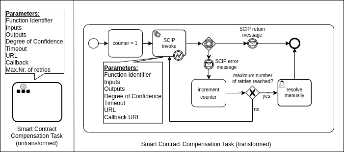

# CaseStudy
Proof of concept for our BPMN extension to use smart contracts in BPMN transactions.
It shows the Smart Contract Invocation Task, and the Smart Contract Compensation Task in a example scenario,
with different errors.

Smart contract invocation task and transformation to standard BPMN:

Smart contract compensation task and transformation to standard BPMN:

The examples invoke smart contract functions on two different Ethereum blockchains, simulated using Ganache.

example-no-errors.bpmn will run without errors.

example-short-timeout.bpmn has a too small timeout for the second smart contract invocation, this should lead to both compensations being triggered.

example-invocation-error.bpmn has a wrong smart contract address for the secons invocation, this should only trigger the first compensation, since the second smart contract was not executed.

example-trigger-manual-resolve.bpmn will reach max nr. of retry and land in the resolve manually task.

Dependecies:
curl
docker
docker-compose

used ports:  8081, 8545, 8546, 8089

Setup:
To bring up the docker containers move to AutomateSetup and run Start.sh. This will build, start and configure the containers and deploy the smart contracts.
To stop the docker containers run Stop.sh.

When the docker containers run and the smart contracts are deployed the example files can be
deployed and started using Camunda Modeler.
The REST endpoint of the camunda container is http://0.0.0.0:8089/engine-rest.
The credentials for the camunda cockpit app are the default credentials:
user:demo
password:demo

The code of this study is based on https://github.com/ghareeb-falazi/SCIP-CaseStudy
